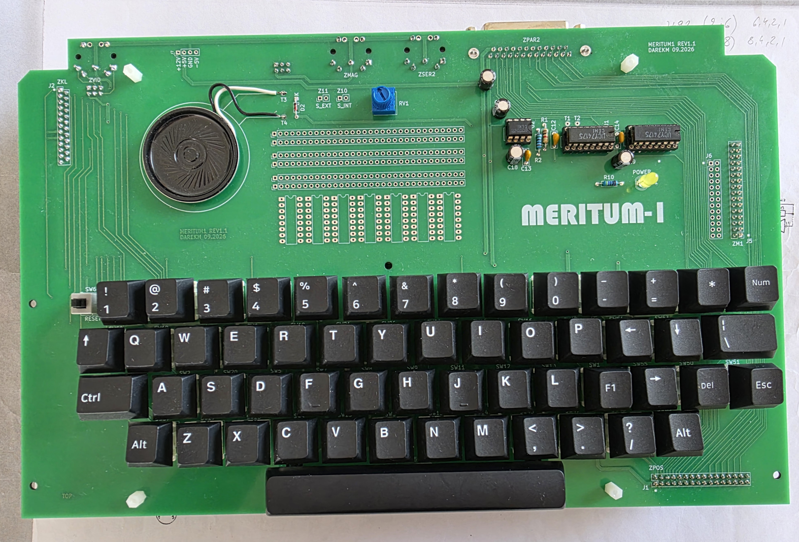

# Meritum 1 - keyboard

This part of the project is the clone of the Meritum 1 keyboard.

## Files
This directory contains: 

* [BOM](bom) - Interactive HTML BOM
* [Gerber](gerber) - files (JLCPCB-compatible zip files)
* [IMG](img) - photos of the keyboard
* [KiCAD](kicad) - project design in KiCAD 10
* [Schematic](schematic) - Schematic in PDF format

## Assembling
As for assembling the keyboard PCB, there are no major challenges here. The board is relatively straightforward to build.  
One piece of information may be more important: for mounting the switches I used gold‑plated hot‑swap sockets for mechanical keyboards.
See: [IMG](img/Meritum1_KLT_BOTTOM.png)

More to follow.
