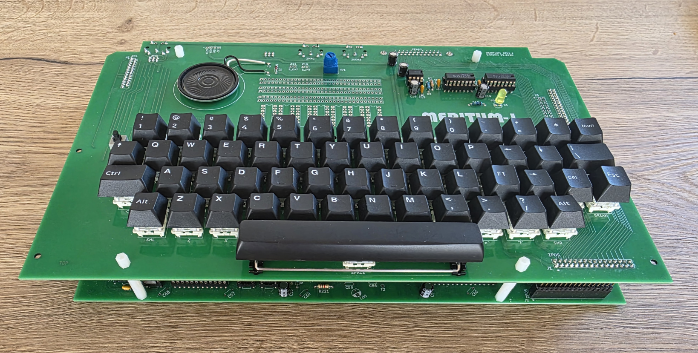

# Meritum-1 clone project
This repository provides all the files needed to build a **Meritum 1** ( https://pl.wikipedia.org/wiki/Meritum_(komputer) ) hardware recreation, closely following the design of the first microcomputer to be mass‑produced in Poland. 

Production of the Meritum computer began in mid‑1983, and its architecture was based on a design similar to the TRS‑80 Model I. Across all versions — Meritum I, II, and III — approximately 2,500 units were produced between 1984 and 1986. 

It has fascinated me for years as an important part of Poland’s computing history. I never had the chance to see an original unit in person, and my attempts to buy one at auctions quickly ended with prices far beyond reach. 
I also noticed that almost no modern projects related to it exist.

Given that, I decided to build one myself: using the documentation available online — schematics, module descriptions, and board photos — I set out to recreate the machine as my own hardware project.

As of September 27, 2026, there are 4 successful builds (based on this pcb project), so the design files can be assumed valid. 

Important notes: 
* Please note that this is a complex hardware project that requires solid technical expertise from anyone who decides to build it. 
* While significant care has been taken during the design and verification process, the project may still contain errors, especially if the original design included fixes implemented directly at the PCB level that were not reflected in the published schematics.

## PCBs
The clone consists of two separate PCBs:
* [Meritum_PGW](Meritum_PGW) (Meritum Płyta Główna) - is the main board.
* [Meritum_KLT](Meritum_KLT) (Meritum Klawiatura) - is a replacement keyboard that uses standard Cherry MX switches.

## ROMs
Since the licensing status of the ROMs used in the Meritum 1 computer is not clear to me, I have not included them in this repository.  
Below, however, I provide links to a websites where they can be found, along with many other valuable resources:
* https://web.archive.org/web/20201023154655/https://sites.google.com/site/krzkomar/meritum-1
* https://www.planetemu.net/rom/mame-roms-merged/meritum1 
  
Many useful materials can also be found at: https://www.speccy.pl/news.php .
  
More to follow.
